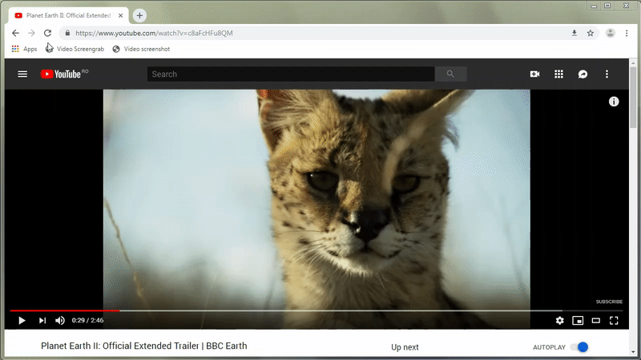

# `<video>` snapshot bookmarklet

> Take a snapshot at the current time in a <video>.

Image shows just the video frame at the size it's displayed, without any overlays.

## :framed_picture: Screenshot

Opens JPEG image in new tab. Click to save it and right-click for context menu options like _Search Google for image_ or _Copy image_ etc. _Save image as..._ [will **not** work.](https://groups.google.com/a/chromium.org/forum/#!msg/blink-dev/GbVcuwg_QjM/GsIAQlemBQAJ "Intent to Deprecate and Remove: Top-frame navigations to data URLs - Google Groups")

Source code: [youtube-screenshot.js](./youtube-screenshot.js)  
Uglified: [youtube-screenshot.min.js](./youtube-screenshot.min.js)  

```js
javascript:"use strict";!function(window,document){var canvas=document.createElement("canvas"),video=document.querySelector("video"),ctx=canvas.getContext("2d");canvas.width=parseInt(video.offsetWidth),canvas.height=parseInt(video.offsetHeight),ctx.drawImage(video,0,0,canvas.width,canvas.height);var base64ImageData=canvas.toDataURL("image/jpeg"),filename="snap-"+canvas.width+"x"+canvas.height+"-"+video.currentTime+".jpg",a=document.createElement("a");a.download=filename,a.href=base64ImageData;var img=document.createElement("img");img.src=base64ImageData,img.alt=filename,img.title="Click to save "+filename,window.open().document.body.appendChild(a).appendChild(img)}(window,document);
```

## :floppy_disk: Screengrab

Download the image directly, without displaying it in a new tab.

Source code: [youtube-screengrab.js](./youtube-screengrab.js)  
Uglified: [youtube-screengrab.min.js](./youtube-screengrab.min.js)  

```js
javascript:"use strict";!function(window,document){var canvas=document.createElement("canvas"),video=document.querySelector("video"),ctx=canvas.getContext("2d");canvas.width=parseInt(video.offsetWidth),canvas.height=parseInt(video.offsetHeight),ctx.drawImage(video,0,0,canvas.width,canvas.height);var a=document.createElement("a");a.download="snap-"+canvas.width+"x"+canvas.height+"-"+video.currentTime+".jpg",a.href=canvas.toDataURL("image/jpeg"),document.body.appendChild(a).click(),a.remove()}(window,document);
```

## Demo



Reference: https://stackoverflow.com/a/13765373/1099314

## TODOs

- [ ] Doesn't work on `file:///` URLs... `SecurityError: Tainted canvases may not be exported.`
